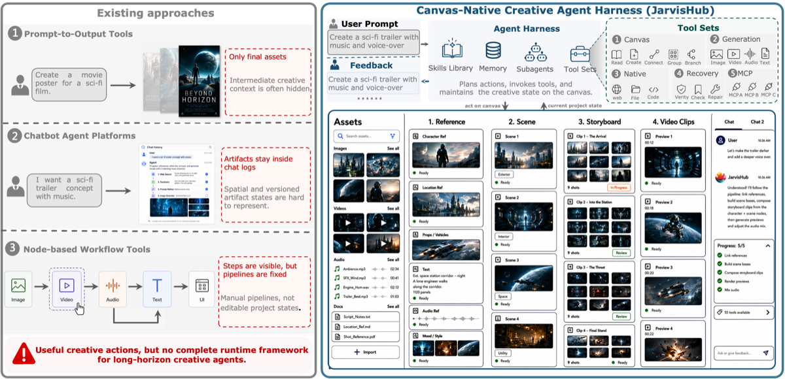
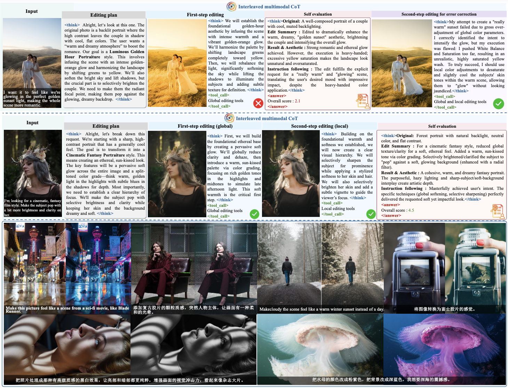
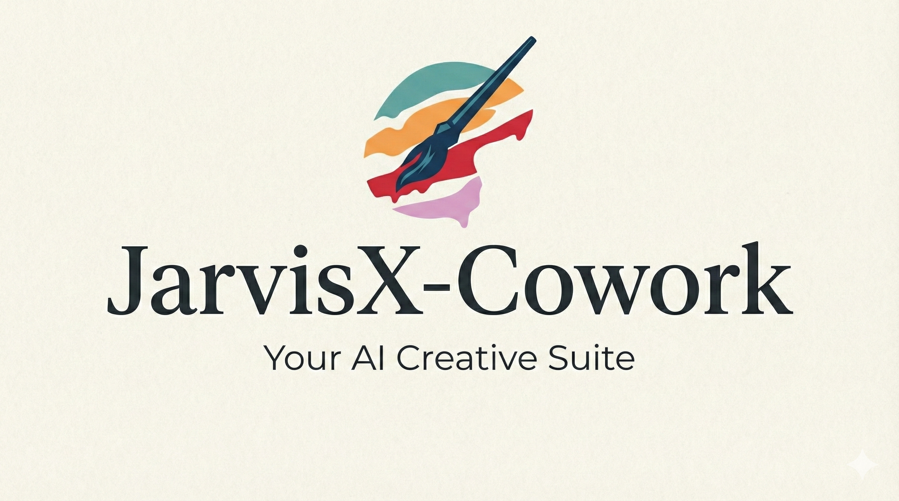
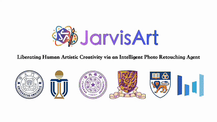
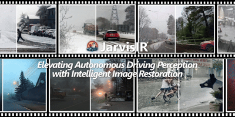

# SmartDSP · Jarvis Research Collection

### Multimodal Agents · Creative AI · Intelligent Image Editing · Image Restoration

A curated collection of **datasets, benchmarks, publications, and research projects** from **SmartDSP Lab**,  
covering multimodal creative agents, intelligent photo editing, human-AI collaboration,  
and image restoration for visual perception.

 

**Datasets · Benchmarks · Publications · Open-source Projects · Interactive Demos**

---

## Overview

The **SmartDSP Jarvis Research Collection** brings together a series of research efforts exploring the evolution of intelligent visual systems from specialized image processing methods toward increasingly general, autonomous, and collaborative multimodal agents.

The collection currently consists of three major components:

- ** Datasets & Benchmarks** — Public datasets and evaluation benchmarks for professional photo retouching, intelligent image editing, and adverse-condition image restoration, including **MMArt-PPR10K**, **MMArt-Bench**, **ArtEdit-Bench**, and **CleanBench**.
- ** Publications from SmartDSP Lab** — Research works spanning intelligent image restoration, multimodal photo-retouching agents, self-evolving editing agents, personal creative assistants, and canvas-native multimodal agents.
- ** Jarvis Research Projects** — A family of intelligent visual and creative systems, including **JarvisIR**, **JarvisArt**, **JarvisEvo**, **JarvisX-Cowork**, and **JarvisHub**.

Together, these works reflect a continuous research trajectory:

**Intelligent Image Restoration → Professional Photo Retouching → Self-Evolving Editing → AI Creative Coworkers → Canvas-Native Multimodal Agents**

The overall goal is to explore how AI systems can move beyond isolated generation or enhancement tasks and become **persistent, interpretable, tool-using, human-steerable collaborators** for visual understanding and creative production.

---

## Table of Contents

- [1. Datasets & Benchmarks](#1-datasets--benchmarks)
  - [Dataset Summary](#dataset-summary)
  - [MMArt-PPR10K](#mmart-ppr10k)
  - [MMArt-Bench](#mmart-bench)
  - [ArtEdit-Bench](#artedit-bench)
  - [CleanBench](#cleanbench)

- [2. Publications from SmartDSP Lab](#2-publications-from-smartdsp-lab)
  - [Publication Summary](#publication-summary)
  - [JarvisHub](#jarvishub)
  - [JarvisEvo](#jarvisevo)
  - [JarvisX-Cowork](#jarvisx-cowork)
  - [JarvisArt](#jarvisart)
  - [JarvisIR](#jarvisir)

---

# 1. Datasets & Benchmarks

This section summarizes the public datasets and evaluation benchmarks associated with the Jarvis series. These resources cover **instruction-driven professional photo retouching**, **preservative image editing**, and **adverse-condition image restoration**.

## Dataset Summary

| Dataset | Related Project | Type | Scale / Content | Main Purpose | Links |
|---|---|---|---|---|---|
| **MMArt-PPR10K** | JarvisArt | Multimodal paired image-retouching dataset | PPR10K-based paired images, multi-granularity user instructions, and Lua/XMP-based Lightroom editing configurations | Research on instruction-driven agentic image retouching | [Dataset](https://huggingface.co/datasets/JarvisArt/MMArt-PPR10k) / [Paper](https://arxiv.org/abs/2506.17612) |
| **MMArt-Bench** | JarvisArt | Multiscenario photo-retouching evaluation benchmark | 200 instances across 4 major scenarios + 50-image portrait subset with mask annotations | Comprehensive image-level and region-level evaluation of agentic photo-retouching systems | [Dataset](https://huggingface.co/datasets/JarvisArt/MMArt-Bench) / [Paper](https://arxiv.org/abs/2506.17612) |
| **ArtEdit-Bench** | JarvisEvo | Image-editing evaluation benchmark | ArtEdit-Bench-Lr: 800 bilingual samples; ArtEdit-Bench-Eval: 200 English samples | Evaluating fine-grained retouching and model self-evaluation capabilities | [Dataset](https://huggingface.co/datasets/JarvisEvo/ArtEdit-Bench) / [Paper](https://arxiv.org/abs/2511.23002) |
| **CleanBench** | JarvisIR | Synthetic + real-world instruction-following image-restoration dataset | 150K synthetic + 80K real instruction-response pairs | Training and evaluating intelligent restoration systems under real-world adverse conditions | [Dataset](https://huggingface.co/datasets/LYL1015/CleanBench) / [Project](https://cvpr2025-jarvisir.github.io/) / [Paper](https://lyl1015.github.io/papers/CVPR2025_JarvisIR.pdf) |

---

## MMArt-PPR10K

**Related Project:** JarvisArt  
**Paper:** *JarvisArt: Liberating Human Artistic Creativity via an Intelligent Photo Retouching Agent*  
**Task:** Instruction-driven professional photo retouching  
**Type:** Multimodal paired image-retouching dataset  
**Source:** Built upon the PPR10K dataset  
**Content:** Paired original and retouched images, multi-granularity user instructions, and Lua/XMP-based Lightroom editing configurations  

### English Introduction

**MMArt-PPR10K**  is a multimodal dataset developed for research on instruction-driven agentic image retouching. Built upon the original PPR10K dataset, it combines paired original and retouched images with natural-language editing instructions and structured information associated with Lightroom editing operations.

Unlike conventional image-to-image datasets that primarily provide input and target images, MMArt-PPR10K additionally incorporates user instructions at different levels of detail together with Lua/XMP-based editing configurations. These components provide information about both the desired editing outcome and the corresponding professional editing process.

This multimodal structure makes MMArt-PPR10K particularly suitable for research on instruction understanding, multimodal reasoning, professional editing-tool use, and agentic photo-retouching workflows.

### 中文简介

**MMArt-PPR10K** 是 JarvisArt 项目面向**指令驱动 Agentic 图像修饰任务**构建的多模态数据集，并基于原始 PPR10K 数据集进行扩展。

与主要提供输入图像和目标图像的传统图像到图像数据集不同，MMArt-PPR10K 除了包含修图前后的成对图像之外，还提供不同详细程度的自然语言用户编辑指令，以及与 Lightroom 编辑操作相关的 Lua/XMP 配置信息。

这些信息能够同时描述用户期望的编辑效果以及与之对应的专业编辑过程。因此，该数据集适合用于研究编辑指令理解、多模态推理、专业修图工具使用以及 Agent 驱动的照片修饰流程。

### Dataset Structure

Each sample is organized in a unique directory containing paired images, user instructions of varying lengths, and Lightroom-related configuration files.

- `before.jpg` — original unedited image
- `processed.jpg` — retouched image
- `user_want_short` — short user instruction
- `user_want_middle` — medium-length user instruction
- `user_want_long` — detailed user instruction
- `config.lua` — Lua configuration used in Lightroom
- `config.xmp` — XMP metadata and editing preset associated with Lightroom

### Links

[**Dataset**](https://huggingface.co/datasets/JarvisArt/MMArt-PPR10k) ·
[**Paper**](https://arxiv.org/abs/2506.17612) ·
[**Project Page**](https://jarvisart.vercel.app/) ·
[**Code**](https://github.com/LYL1015/JarvisArt)

---

## MMArt-Bench

**Related Project:** JarvisArt  
**Paper:** *JarvisArt: Liberating Human Artistic Creativity via an Intelligent Photo Retouching Agent*  
**Task:** Agentic photo-retouching evaluation 
**Type:** Multiscenario photo-retouching evaluation benchmark
**Source:** Sampled from the MMArt dataset
**Scale:** 200 benchmark instances across four major scenarios
**Scenarios:** Portrait · Landscape · Street Scenes · Still Life
**Region-Level Evaluation:** 50 human-centered portrait images with mask annotations

### English Introduction

**MMArt-Bench** is an evaluation benchmark introduced with JarvisArt to provide a comprehensive assessment of agentic photo-retouching performance. It is sampled from the broader MMArt dataset and covers diverse real-world photographic scenarios.

The benchmark contains four major categories — **portrait, landscape, street scenes, and still life** — with 50 instances in each category, resulting in **200 benchmark instances** in total. Each primary category is further divided into multiple subcategories to cover a broader range of photographic content.

In addition to image-level evaluation, MMArt-Bench supports **region-level evaluation** through a dedicated portrait subset containing **50 human-centered images with mask annotations**. This enables more fine-grained assessment of localized photo-retouching performance.

MMArt-Bench serves as the evaluation component of the MMArt ecosystem, complementing datasets such as MMArt-PPR10K by providing a standardized benchmark for assessing agentic photo-retouching systems across diverse scenarios and evaluation granularities.

### 中文简介

**MMArt-Bench** 是 JarvisArt 项目提出的**照片修饰评测基准**，用于对 Agentic 照片修饰系统的性能进行综合评估。该 Benchmark 从更大的**MMArt 数据集**中采样构建，并覆盖多种真实摄影场景。

MMArt-Bench 包含 **人像（Portrait）、风景（Landscape）、街景（Street Scenes）和静物（Still Life）**四类主要场景，每类包含 50 个评测实例，共计 **200 个 Benchmark Instances**。每个主要类别还进一步划分为多个子类别，以覆盖更加丰富的摄影内容。

除整体图像层面的评测之外，MMArt-Bench 还提供用于**区域级评测（Region-Level Evaluation）**的人像子集。该子集包含 **50 张以人物为中心的图像及对应的 Mask 标注**，可用于更加细粒度地评估局部区域的照片修饰效果。

MMArt-Bench 可以视为 MMArt 数据体系中的评测组成部分，与 MMArt-PPR10K 等数据集形成互补，为不同场景和不同评测粒度下的 Agentic 照片修饰系统提供标准化评估数据。

### Links

[**Dataset**](https://huggingface.co/datasets/JarvisArt/MMArt-Bench) ·
[**Paper**](https://arxiv.org/abs/2506.17612) ·
[**Project Page**](https://jarvisart.vercel.app/) ·
[**Code**](https://github.com/LYL1015/JarvisArt)

---

## ArtEdit-Bench

**Related Project:** JarvisEvo  
**Paper:** *JarvisEvo: Towards a Self-Evolving Photo Editing Agent with Synergistic Editor-Evaluator Optimization*  
**Task:** Photo-retouching and self-evaluation assessment  
**Type:** Image-editing evaluation benchmark  
**Scale:** 1,000 benchmark samples across two subsets  
**Subsets:** ArtEdit-Bench-Lr · ArtEdit-Bench-Eval  
**Evaluation Focus:** Global and local fine-grained retouching · Model self-evaluation

### English Introduction

**ArtEdit-Bench** is an image-editing evaluation benchmark introduced with JarvisEvo for assessing both photo-retouching and model self-evaluation capabilities. It consists of two complementary subsets: **ArtEdit-Bench-Lr** and **ArtEdit-Bench-Eval**.

**ArtEdit-Bench-Lr** contains **800 samples**, including 400 English and 400 Chinese samples selected from the ArtEdit-Lr dataset. It is designed to evaluate both **global and local fine-grained retouching capabilities**, providing a benchmark for assessing how effectively image-editing systems perform detailed photo-retouching tasks across different editing granularities.

**ArtEdit-Bench-Eval** contains **200 English samples** sampled from the ArtEdit-Eval dataset. This subset is designed to assess a model's **self-evaluation capabilities** and enables comparison with dedicated assessment models.

Together, the two subsets allow ArtEdit-Bench to evaluate not only the editing performance of intelligent photo-editing systems but also their ability to assess editing results. This makes the benchmark particularly relevant to JarvisEvo's unified editor-evaluator framework, in which editing and evaluation capabilities are jointly developed.

### 中文简介

**ArtEdit-Bench** 是 JarvisEvo 项目提出的**图像编辑评测基准**，主要用于评估智能照片编辑系统的修图能力以及模型自身的评价能力。该 Benchmark 由两个相互补充的子集组成：**ArtEdit-Bench-Lr** 和 **ArtEdit-Bench-Eval**。

**ArtEdit-Bench-Lr** 包含 **800 个样本**，其中包括 400 个英文样本和 400 个中文样本，这些数据从 ArtEdit-Lr 数据集中选取得到。该子集主要用于评估模型的**全局和局部细粒度照片修饰能力（Global and Local Fine-Grained Retouching）**，从而衡量图像编辑系统在不同编辑粒度下完成专业修图任务的能力。

**ArtEdit-Bench-Eval** 包含从 ArtEdit-Eval 数据集中采样得到的 **200 个英文样本**，主要用于评估模型的**自我评价能力（Self-Evaluation Capability）**，并与其他专门的评估模型进行公平比较。

因此，ArtEdit-Bench 不仅关注智能图像编辑系统“如何完成编辑任务”，还进一步关注模型“如何评价编辑结果”。这种双重评测设计与 JarvisEvo 的统一 Editor-Evaluator 框架相对应，使其能够同时衡量模型的照片编辑能力和自我评价能力。

### Links

[**Dataset**](https://huggingface.co/datasets/JarvisEvo/ArtEdit-Bench) ·
[**Paper**](https://arxiv.org/abs/2511.23002) ·
[**Project Page**](https://jarvisevo.vercel.app/) ·
[**Code**](https://github.com/LYL1015/JarvisEvo)

---

## CleanBench

**Related Project:** JarvisIR  
**Paper:** *JarvisIR: Elevating Autonomous Driving Perception with Intelligent Image Restoration*  
**Venue:** CVPR 2025  
**Task:** Intelligent image restoration for robust autonomous-driving perception  
**Type:** Synthetic + real-world instruction-following image-restoration dataset  
**Scale:** 150K synthetic + 80K real instruction-response pairs  
**Coverage:** Diverse adverse-weather and coupled image degradations  
**Purpose:** Training and evaluation of intelligent image-restoration systems

### English Introduction

**CleanBench** is a large-scale instruction-following image-restoration dataset introduced with JarvisIR to support the training and evaluation of intelligent restoration systems under challenging real-world conditions.

The complete CleanBench dataset consists of approximately **150K synthetic and 80K real instruction-response pairs**. The synthetic component provides controlled degraded data for supervised learning, while the real-world component is designed to improve robustness and generalization under complex adverse-weather conditions.

Rather than focusing only on a single predefined restoration task, CleanBench supports intelligent restoration systems that must understand image degradation conditions and determine appropriate restoration strategies. Its construction incorporates degraded images together with assessment reasoning, restoration task sequences, and corresponding instruction-response data.

CleanBench plays an important role in JarvisIR's two-stage training framework. Synthetic CleanBench data is used for supervised fine-tuning to develop instruction-following and degradation-recognition capabilities, while CleanBench-Real supports human-feedback alignment for improving robustness, reducing hallucinations, and enhancing generalization to real-world adverse weather.

By supporting both intelligent restoration decision-making and downstream perception-oriented evaluation, CleanBench helps connect **low-level image restoration** with **robust high-level perception in autonomous-driving environments**.

### 中文简介

**CleanBench** 是 JarvisIR 项目提出的大规模**指令跟随图像恢复数据集（Instruction-Following Image-Restoration Dataset）**，主要用于支持智能图像恢复系统在复杂真实环境下的训练与评估。

完整的 CleanBench 包含约 **15 万组合成数据和 8 万组真实数据对应的 Instruction-Response Pairs**。其中，合成数据主要提供可控的图像退化样本，用于监督学习；真实数据则面向更加复杂的真实恶劣天气环境，以提升系统的鲁棒性和泛化能力。

与仅针对某一种预定义退化类型执行固定恢复操作的数据集不同，CleanBench 面向更加智能化的 Restoration System：模型不仅需要处理退化图像，还需要理解当前图像的退化情况，并据此确定合适的恢复策略。其数据构建过程结合了退化图像、退化评估推理、最优恢复任务序列以及相应的 Instruction-Response 数据。

CleanBench 同时服务于 JarvisIR 的两阶段训练框架。Synthetic 数据用于监督微调，使模型学习指令跟随和图像退化识别能力；CleanBench-Real 则用于 Human Feedback Alignment，以进一步提升系统在真实恶劣天气条件下的鲁棒性、降低幻觉并增强泛化能力。

因此，CleanBench 不仅服务于低层图像恢复任务，还进一步支持面向自动驾驶视觉系统的感知性能研究，在**低层图像恢复（Low-Level Image Restoration）**与**高层自动驾驶视觉感知（High-Level Perception）**之间建立联系。

### Public Releases

- **CleanBench-Synthetic** — approximately 150K synthetic instruction-response pairs in the complete CleanBench definition
- **CleanBench-Real** — approximately 80K real-world instruction-response pairs in the complete CleanBench definition
- **CleanBench-Real-80K** — publicly released real-world data for training and evaluation
- **CleanBench-Test (Paper Test)** — test data released for reproducing the experiments reported in the paper

### Links

[**Dataset**](https://huggingface.co/datasets/LYL1015/CleanBench) ·
[**Project Page**](https://cvpr2025-jarvisir.github.io/) ·
[**Paper**](https://lyl1015.github.io/papers/CVPR2025_JarvisIR.pdf) ·
[**Code**](https://github.com/LYL1015/JarvisIR)

---

# 2. Publications from SmartDSP Lab

This section summarizes the featured Jarvis research projects and publications from **SmartDSP Lab**, tracing the progression from intelligent image restoration to professional photo editing, self-evolving agents, end-to-end creative assistants, and canvas-native multimodal systems.

## Publication Summary

| Year | Project | Research / Method Type | Authors | Venue / Status | Links |
|---|---|---|---|---|---|
| 2026 | **JarvisHub: An Open Harness for Canvas-Native Multimodal Creative Agents** |Canvas-native multimodal creative-agent harness | Yunlong Lin et al. | Preprint / arXiv 2026 | [Project](https://www.jarvishub.site/) / [Paper](https://arxiv.org/abs/2607.23588) / [Code](https://github.com/LYL1015/JarvisHub) / [HF](https://huggingface.co/papers/2607.23588) |
| 2026 | **JarvisEvo: Towards a Self-Evolving Photo Editing Agent with Synergistic Editor-Evaluator Optimization** | Self-evolving multimodal photo-editing agent | Yunlong Lin et al. | CVPR 2026 | [Project](https://jarvisevo.vercel.app/) / [Paper](https://arxiv.org/abs/2511.23002) / [Code](https://github.com/LYL1015/JarvisEvo) / [HF](https://huggingface.co/papers/2511.23002) |
| — | **JarvisX-Cowork: A Personal AI Creative Assistant for End-to-End Creative Workflows** | Personal multimodal creative assistant | — | Demo / Open-source Project | [Code](https://github.com/LYL1015/JarvisX-Cowork) / [Demo](https://youtu.be/SiNsTmGbWlo) |
| 2025 | **JarvisArt: Liberating Human Artistic Creativity via an Intelligent Photo Retouching Agent** | MLLM-driven professional photo-retouching agent | Yunlong Lin et al. | NeurIPS 2025 | [Project](https://jarvisart.vercel.app/) / [Paper](https://arxiv.org/abs/2506.17612) / [Code](https://github.com/LYL1015/JarvisArt) / [HF](https://huggingface.co/papers/2506.17612) |
| 2025 | **JarvisIR: Elevating Autonomous Driving Perception with Intelligent Image Restoration** | Intelligent image-restoration agent | Yunlong Lin et al. | CVPR 2025 | [Project](https://cvpr2025-jarvisir.github.io/) / [Paper](https://lyl1015.github.io/papers/CVPR2025_JarvisIR.pdf) / [Code](https://github.com/LYL1015/JarvisIR) / [Demo](https://huggingface.co/spaces/LYL1015/JarvisIR) |

---

## JarvisHub

### An Open Harness for Canvas-Native Multimodal Creative Agents

<table>
<tr>
<td width="31%" align="center">

</td>

<td width="69%">

**Year:** 2026  
**Venue / Status:** arXiv Preprint  
**arXiv Category:** Computer Vision and Pattern Recognition (cs.CV)  
**Submitted:** July 26, 2026  
**Method Type:** Canvas-native multimodal creative-agent harness  
**Task:** Long-horizon multimodal creative production  

**Authors:**  
Yunlong Lin, Zixu Lin, Zhaohu Xing, Biqiang Li, Chenxin Li, Haonan Wang, Haitao Wu, Hengyu Liu, Jianghai Chen, Kaituo Feng, Kaixin Li, Shawn Chen, Shijue Huang, Sixiang Chen, Tsung-Yi Ho, Wenxuan Huang, Xiangyan Liu, Xiaomeng Hu, Xuanhua He, Yan Sun, Yunqing Zhao, Zhiqin Yang, Zehan Wang, Zhengyang Tang, Tianyu Pang, Xiangyu Yue

**Links:**  
[Project](https://www.jarvishub.site/) /
[Paper](https://arxiv.org/abs/2607.23588) /
[Code](https://github.com/LYL1015/JarvisHub) /
[Hugging Face](https://huggingface.co/papers/2607.23588)

### Highlights

- Introduces an open **canvas-native creative-agent harness** for long-horizon multimodal creation.
- Treats the editable canvas simultaneously as the **user workspace, agent external memory, action space, and shared project state**.
- Represents multimodal artifacts, dependencies, versions, status, and feedback through structured canvas nodes and links.
- Employs a three-layer architecture consisting of **Canvas State, Protocol Bridge, and Agent Runtime**.
- Enables agents to progressively **plan, generate, revise, and organize** multimodal projects over extended creative workflows.
- Preserves **human steerability** by allowing users to inspect, guide, modify, and intervene throughout the creative process.
- Functions as an **agent orchestration harness rather than a standalone generative model**, integrating external models and tools within a persistent and inspectable creative workspace.

</td>
</tr>
</table>

### English Introduction

**JarvisHub** is an open harness for **canvas-native multimodal creative agents**, designed to support long-horizon multimodal creative production.

Modern generative models can produce high-quality images, videos, audio clips, webpages, UI elements, presentations, and other creative assets. However, real-world creative work rarely consists of isolated prompt-output interactions. Instead, a complete project evolves through references, drafts, alternatives, edits, failed attempts, version relationships, tool actions, evaluation signals, and human feedback, which together form an evolving project state.

JarvisHub addresses this challenge by placing an editable visual **Canvas** at the center of the agent workflow. Rather than serving merely as a user interface, the Canvas simultaneously functions as the **user workspace, the agent's external memory, its action space, and a persistent shared project state**.

Multimodal artifacts and their relationships are represented through typed canvas nodes and links, allowing references, dependencies, versions, status, and feedback to remain explicitly represented throughout extended creative workflows.

JarvisHub organizes this process through a three-layer architecture consisting of **Canvas State, Protocol Bridge, and Agent Runtime**. Canvas State maintains editable artifacts and their relationships; the Protocol Bridge exposes capabilities, validates actions, and manages state transitions; and the Agent Runtime observes the canvas, plans actions, invokes models and tools, and returns results to the shared workspace.

Importantly, JarvisHub is **not intended to replace existing generative models**. Instead, it provides an open and inspectable agent runtime for preserving context, orchestrating external tools and models, incorporating feedback, and recovering from failures across long-horizon creative workflows.

This design moves Creative AI beyond isolated generation and tool invocation toward **sustained, human-steerable creative automation**, where agents can progressively plan, generate, revise, and organize complex multimodal projects while users remain able to inspect, guide, and intervene throughout the process.

### 中文简介

**JarvisHub** 是一个面向 **Canvas-Native Multimodal Creative Agents（画布原生多模态创意智能体）** 的开放式 Agent Harness，主要研究 AI 如何在持续维护项目状态的情况下完成**长周期、多阶段的复杂多模态创作任务**。

当前的图像、视频、音频、网页、UI 和演示文稿等生成模型已经具有较强的单次内容生成能力，但真实创作过程通常并不是简单的“输入 Prompt—生成结果”。一个完整项目往往还包含参考资料、多个草稿、候选方案、修改过程、失败尝试、版本关系、工具操作、评价信号以及持续的人类反馈，这些信息共同构成不断演化的项目状态。

JarvisHub 将**可编辑 Canvas** 作为整个系统的核心。Canvas 不仅承担用户交互界面的作用，同时还充当**用户工作空间、智能体的外部记忆、操作空间以及持久化的共享项目状态**。多模态内容以及它们之间的依赖关系、版本关系、状态和反馈信息，都可以通过结构化的 Canvas 节点与连接进行显式表示。

JarvisHub 采用 **Canvas State、Protocol Bridge 和 Agent Runtime** 三层架构。其中，Canvas State 负责维护可编辑内容及其关系；Protocol Bridge 负责暴露系统能力、验证操作并管理状态转换；Agent Runtime 则负责观察当前 Canvas、规划下一步操作、调用模型与工具，并将新的结果重新写入共享工作空间。

需要特别说明的是，**JarvisHub 本身并不是用于替代现有生成模型的新生成模型**。它更接近一个开放、可检查的智能体运行与编排框架，通过整合外部生成模型、工具和其他 Agent 能力，使智能体能够在长期创作过程中保持上下文、利用反馈并从失败中恢复。

因此，JarvisHub 将 Creative AI 从传统的单次内容生成和孤立工具调用进一步扩展为**持续、可干预、以项目状态为中心的长周期多模态创意智能体工作流**。

---

## JarvisEvo

### Towards a Self-Evolving Photo Editing Agent with Synergistic Editor-Evaluator Optimization

<table>
<tr>
<td width="31%" align="center">

</td>

<td width="69%">

**Year:** 2026  
**Venue:** IEEE/CVF Conference on Computer Vision and Pattern Recognition (**CVPR 2026**)  
**Preprint:** arXiv:2511.23002  
**First Submitted:** November 28, 2025

**Authors:**  
Yunlong Lin, Linqing Wang, Kunjie Lin, Zixu Lin, Kaixiong Gong, Wenbo Li, Bin Lin, Zhenxi Li, Shiyi Zhang, Yuyang Peng, Wenxun Dai, Xinghao Ding, Chunyu Wang, Qinglin Lu

**Links:**  
[Project](https://jarvisevo.vercel.app/) /
[Paper](https://arxiv.org/abs/2511.23002) /
[PDF](https://arxiv.org/pdf/2511.23002) /
[Code](https://github.com/LYL1015/JarvisEvo) /
[Hugging Face](https://huggingface.co/papers/2511.23002)

### Highlights

- Introduces a unified image-editing agent that imitates the iterative workflow of a professional human designer.
- Proposes **interleaved Multimodal Chain-of-Thought (iMCoT)** reasoning.
- Introduces **Synergistic Editor-Evaluator Policy Optimization (SEPO)** for self-improvement without external rewards.
- Targets both **instruction hallucination** and **reward hacking** in agent-based image editing.
- Supports global and local fine-grained editing.
- Integrates Adobe Lightroom into the agent workflow.
- Demonstrates strong preservative editing and pixel-level content fidelity on ArtEdit-Bench.

</td>
</tr>
</table>

### English Introduction

**JarvisEvo** is a unified **self-evolving photo-editing agent** designed to emulate how an expert human designer edits, evaluates, reflects, and progressively improves visual content.

Existing editing agents have significantly improved interaction and automation, but important limitations remain. Text-only reasoning can lose critical visual information and lead to instruction hallucination, while policy optimization against static reward models may encourage reward hacking.

JarvisEvo addresses the first problem through **interleaved Multimodal Chain-of-Thought (iMCoT)**, which tightly integrates visual observations with the reasoning process. Rather than reasoning only from textual descriptions, the agent can directly consider intermediate visual states while deciding what to do next.

To address reward hacking and enable self-improvement, JarvisEvo further introduces **Synergistic Editor-Evaluator Policy Optimization (SEPO)**. The Editor and Evaluator improve jointly, forming a closed loop of **editing → evaluation → reflection → refinement**.

Through its integration with Adobe Lightroom, JarvisEvo supports both global and local fine-grained editing, advancing intelligent image editing from passive instruction execution toward agents capable of **visual reasoning, self-evaluation, tool selection, reflection, and iterative self-improvement**.

### 中文简介

**JarvisEvo** 是一个具有**自我演化能力的智能图像编辑 Agent**，其整体工作方式模拟专业设计师在实际修图过程中的行为：理解任务、选择工具、执行编辑、观察结果、评价当前效果，并根据评价结果持续反思和优化后续操作。

针对现有智能编辑 Agent 中存在的两个关键问题，JarvisEvo 提出了对应解决方案。

首先，纯文本 Chain-of-Thought 在复杂视觉编辑任务中容易受到信息瓶颈影响，从而产生指令理解偏差或视觉事实错误。为此，JarvisEvo 提出了 **iMCoT（Interleaved Multimodal Chain-of-Thought）**，将视觉观察与推理过程交错结合，使智能体能够直接依据当前图像状态进行推理和决策。

其次，针对基于固定 Reward Model 的策略优化可能产生的 Reward Hacking 问题，JarvisEvo 提出了 **SEPO（Synergistic Editor-Evaluator Policy Optimization）**。Editor 与 Evaluator 在统一框架中协同优化，使 Agent 能够通过“**编辑—评价—反思—改进**”的闭环实现持续自我提升。

此外，JarvisEvo 与 Adobe Lightroom 集成，可同时支持全局调整和局部精细编辑。

该项目推动智能图像编辑从“一次执行用户指令”的模式进一步发展为具有**视觉推理、自我评价、自我反思和持续优化能力的 Self-Evolving Creative Agent**。

---

## JarvisX-Cowork

### A Personal AI Creative Assistant for End-to-End Creative Workflows

<table>
<tr>
<td width="31%" align="center">

</td>

<td width="69%">

**Status:** Demo / Open-source Project  
**Type:** Personal multimodal creative assistant  
**Task:** End-to-end AI-assisted creative workflows  
**Research Direction:** Human-AI creative collaboration  

**Keywords:**  
Creative Agent · AI Cowork · Multimodal Assistant · Human-AI Collaboration · End-to-End Workflow

**Links:**  
[Code](https://github.com/LYL1015/JarvisX-Cowork) /
[Demo Video](https://youtu.be/SiNsTmGbWlo)

### Highlights

- Provides a personal AI creative assistant for complete end-to-end workflows.
- Goes beyond isolated prompt-response interactions.
- Supports multiple stages of a creative project rather than only a single generation task.
- Combines multimodal understanding, content generation, organization, and workflow assistance.
- Explores AI as a persistent **creative coworker** rather than a single-purpose generation tool.

</td>
</tr>
</table>

### English Introduction

**JarvisX-Cowork** is a personal AI creative assistant designed to support **end-to-end creative workflows**.

Conventional AI tools typically perform isolated tasks such as generating one image, answering one question, or producing one piece of text. Real creative work, however, usually involves a much longer sequence of interconnected stages.

A typical workflow may include discovering inspiration, collecting references, organizing materials, developing concepts, creating visual assets, revising intermediate results, and assembling a final deliverable.

JarvisX-Cowork explores how an AI agent can participate throughout this complete process rather than appearing only at a single generation step.

The project therefore positions AI as a persistent **creative coworker**. By combining multimodal understanding, agentic interaction, content generation, and workflow support, JarvisX-Cowork explores how personal AI systems can collaborate with users throughout longer, more complex, and more realistic creative tasks.

### 中文简介

**JarvisX-Cowork** 是一个面向个人用户的 **AI 创意协作助手（Personal AI Creative Assistant）**，主要目标是让 AI 真正参与完整的端到端创作流程。

传统生成式 AI 工具通常只能完成某一个孤立环节，例如生成一张图片、回答一个问题或生成一段文字。但真实创作过程往往由多个相互关联的阶段组成，包括灵感寻找、参考资料收集、内容构思、素材组织、视觉内容生成、中间结果修改以及最终作品整理。

JarvisX-Cowork 尝试将 Agent 能力融入这一完整流程，使 AI 不再只是一个偶尔调用的生成工具，而是能够在不同创作阶段持续协助用户完成任务的 **Personal AI Coworker**。

因此，该项目重点探索 **Human-AI Creative Collaboration**：如何让多模态 Agent 从传统的单一功能工具进一步发展为能够理解创作上下文、参与多阶段任务并长期协助用户完成复杂目标的智能协作者。

---

## JarvisArt

### Liberating Human Artistic Creativity via an Intelligent Photo Retouching Agent

<table>
<tr>
<td width="31%" align="center">

</td>

<td width="69%">

**Year:** 2025  
**Venue:** Conference on Neural Information Processing Systems (**NeurIPS 2025**)  
**Preprint:** arXiv:2506.17612  
**First Submitted:** June 21, 2025

**Authors:**  
Yunlong Lin, Zixu Lin, Kunjie Lin, Jinbin Bai, Panwang Pan, Chenxin Li, Haoyu Chen, Zhongdao Wang, Xinghao Ding, Wenbo Li, Shuicheng Yan

**Links:**  
[Project](https://jarvisart.vercel.app/) /
[Paper](https://arxiv.org/abs/2506.17612) /
[Code](https://github.com/LYL1015/JarvisArt) /
[Hugging Face](https://huggingface.co/papers/2506.17612) /
[YouTube](https://www.youtube.com/watch?v=Ol28DQj8wV8) /
[Bilibili](https://www.bilibili.com/video/BV1Sd3nzREvP)

### Highlights

- Introduces an **MLLM-driven intelligent agent** for professional photo retouching.
- Understands natural-language user intentions and imitates the reasoning process of professional artists.
- Coordinates more than **200 Adobe Lightroom retouching tools**.
- Uses two-stage training with Chain-of-Thought supervised fine-tuning and **GRPO-R**.
- Introduces the **Agent-to-Lightroom Protocol** for seamless interaction with Lightroom.
- Proposes **MMArt-Bench**, constructed from real-world user editing scenarios.
- Supports fine-grained global and local image adjustment.
- Demonstrates strong generalization, controllability, and user-friendly interaction.

</td>
</tr>
</table>

### English Introduction

**JarvisArt** is an intelligent **photo-retouching agent** designed to bridge high-level human artistic intentions and professional image-editing operations.

Professional software such as Adobe Lightroom provides powerful editing capabilities, but effective use requires substantial technical expertise, artistic judgment, and manual effort. Existing AI editing systems offer greater automation, but often suffer from limited controllability and insufficient generalization for diverse and personalized editing requirements.

JarvisArt addresses this gap using a **Multimodal Large Language Model (MLLM)-driven agent**. The system understands natural-language user intent, analyzes visual content, imitates the reasoning process of professional artists, and intelligently coordinates more than **200 retouching tools in Adobe Lightroom**.

The model adopts a two-stage training strategy. First, Chain-of-Thought supervised fine-tuning establishes fundamental visual reasoning and tool-use skills. It then applies **Group Relative Policy Optimization for Retouching (GRPO-R)** to further improve editing decisions and professional tool proficiency.

JarvisArt also introduces the **Agent-to-Lightroom Protocol**, enabling seamless interaction between the intelligent agent and Lightroom.

To evaluate professional photo-retouching performance, the project introduces **MMArt-Bench**, a benchmark constructed from real-world editing scenarios.

Overall, JarvisArt demonstrates how multimodal agents can serve as professional creative collaborators, translating abstract artistic intentions into **controllable, fine-grained, and executable photo-retouching operations**.

### 中文简介

**JarvisArt** 是一个面向专业照片修饰场景的**智能修图 Agent**，旨在解决用户高层艺术意图与专业图像编辑操作之间存在的巨大鸿沟。

Adobe Lightroom 等专业软件虽然具有非常丰富的编辑能力，但用户通常需要掌握大量参数、专业工具和视觉设计知识，才能将自己的审美需求转换为具体操作。传统 AI 图像编辑系统虽然提高了自动化程度，却往往存在可控性不足、泛化能力有限以及难以满足复杂个性化需求等问题。

JarvisArt 采用 **MLLM 驱动的 Agent 架构**。智能体能够理解用户自然语言中的编辑需求，同时分析输入图像，并模仿专业艺术家的推理过程，在 Adobe Lightroom 中智能协调超过 **200 个专业修图工具**。

在训练方面，JarvisArt 采用两阶段方案：首先通过 Chain-of-Thought 监督微调获得基础视觉推理和工具调用能力；随后使用专门针对修图任务设计的 **GRPO-R（Group Relative Policy Optimization for Retouching）**进一步提升决策能力和工具使用水平。

此外，项目提出 **Agent-to-Lightroom Protocol**，实现 Agent 与 Lightroom 之间的无缝交互，并构建来自真实用户编辑场景的 **MMArt-Bench** 作为专业修图评测基准。

JarvisArt 展示了多模态智能体作为专业创意协作者的可能性，使 AI 能够将抽象艺术意图转化为**细粒度、可控且真正可以在专业软件中执行的图像编辑操作**。

---

## JarvisIR

### Elevating Autonomous Driving Perception with Intelligent Image Restoration

<table>
<tr>
<td width="31%" align="center">

</td>

<td width="69%">

**Year:** 2025  
**Venue:** IEEE/CVF Conference on Computer Vision and Pattern Recognition (**CVPR 2025**)  
**Publication Date:** June 2025  
**Method Type:** Intelligent image-restoration agent  
**Task:** Image restoration for robust autonomous-driving perception  

**Authors:**  
Yunlong Lin, Zixu Lin, Haoyu Chen, Panwang Pan, Chenxin Li, Sixiang Chen, Wen Kairun, Yeying Jin, Wenbo Li, Xinghao Ding

**Links:**  
[Project](https://cvpr2025-jarvisir.github.io/) /
[Paper](https://lyl1015.github.io/papers/CVPR2025_JarvisIR.pdf) /
[Code](https://github.com/LYL1015/JarvisIR) /
[Hugging Face Demo](https://huggingface.co/spaces/LYL1015/JarvisIR)

### Highlights

- Published at **CVPR 2025**.
- Introduces an intelligent image-restoration agent for autonomous-driving perception.
- Targets diverse real-world degradation and adverse visual conditions.
- Uses intelligent analysis and decision-making to coordinate appropriate restoration capabilities.
- Connects low-level image restoration with high-level downstream visual perception.
- Explores an **agent-oriented restoration paradigm** instead of relying on one fixed restoration model.

</td>
</tr>
</table>

### English Introduction

**JarvisIR** explores intelligent image restoration from an **agent-oriented perspective**, with the goal of improving visual perception in autonomous-driving scenarios.

Real-world autonomous systems frequently encounter degraded visual inputs caused by challenging environments and imaging conditions. These degradations reduce image quality and can consequently affect downstream perception tasks.

Traditional image-restoration methods typically rely on fixed models designed for specific degradation types. In contrast, JarvisIR introduces intelligent analysis and decision-making into the restoration workflow.

The system can analyze the degradation condition of an input image and coordinate appropriate restoration capabilities according to the observed visual problem.

This transforms image restoration from a fixed low-level processing pipeline into a more flexible and adaptive intelligent workflow.

By connecting restoration decisions with autonomous-driving perception requirements, JarvisIR establishes a bridge between **low-level image enhancement and restoration** and **high-level visual perception**.

The work was published at the **IEEE/CVF Conference on Computer Vision and Pattern Recognition (CVPR), 2025**.

### 中文简介

**JarvisIR** 是一个面向自动驾驶视觉感知场景的**智能图像恢复 Agent**，发表于 **CVPR 2025**。该项目重点研究复杂现实环境中的图像退化问题，以及智能图像恢复如何提升自动驾驶视觉系统的可靠性。

现实中的自动驾驶车辆可能遇到多种复杂成像和环境条件。这些视觉退化不仅会降低图像本身的质量，还可能进一步影响目标检测、场景理解以及其他下游视觉感知任务。

传统图像恢复方法通常针对某一种特定退化类型设计固定模型，而 JarvisIR 则从 **Agent-Oriented Image Restoration** 的角度重新组织整个恢复流程。

系统能够主动分析当前输入图像所面临的退化状态，并根据不同问题协调相应的恢复能力，从而形成更加灵活和自适应的智能恢复流程。

因此，JarvisIR 不再将图像恢复视为完全独立的低层视觉任务，而是进一步探索如何将**低层图像恢复与高层自动驾驶视觉感知相结合**，为复杂真实环境中的智能视觉系统提供更加可靠的视觉输入。

---

## SmartDSP Lab

### From Intelligent Visual Restoration to Canvas-Native Creative Agents

**JarvisIR → JarvisArt → JarvisEvo → JarvisX-Cowork → JarvisHub**

 

Exploring **multimodal agents, intelligent visual systems, human-AI collaboration,  
creative AI, and long-horizon multimodal workflows**.

  

SmartDSP Lab · Datasets · Benchmarks · Publications · Open-source Research Projects

